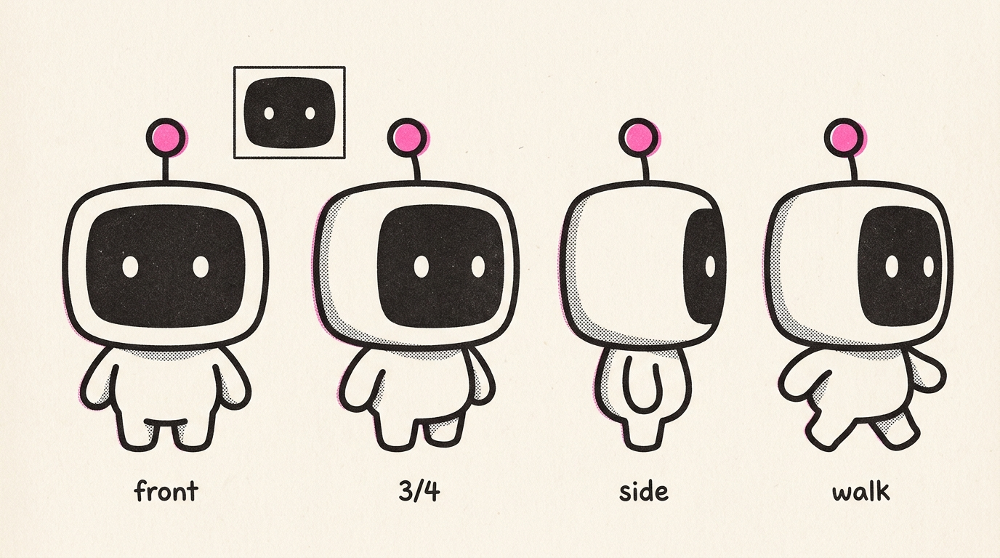

# Blip

Turn a concept or an article into original **risograph-style editorial
illustrations** — grainy, flat, bold-lined scenes where **Blip**, a recurring
screen-faced robot mascot, performs the idea. One image says one thing: a key
judgment, a flow, a before/after, a trap. It's a deliberate house style, not a
generic image generator — closer to a smart, deadpan print zine than to clip
art or an infographic.

The look is consistent across pieces (Blip + a locked risograph technique),
while the **palette is a free parameter**: pick a named preset, use a
blog-matched palette that blends into your site, or hand it one brand color and
let it derive the rest.



## Prerequisites

- An **[OpenRouter](https://openrouter.ai) API key**. Images are generated by a
  small bundled script (`scripts/blip.py`) that calls OpenRouter's image API
  directly — no extra services or installs.
- **`python3`** (standard library only) and network access. macOS/Linux.
- The engine is **model-selectable**: default Grok Imagine
  (`x-ai/grok-imagine-image-quality`), or pass any OpenRouter image model
  (Nano Banana 2/Pro, GPT-5.4 Image 2, …) per request. If your account can't
  reach the default, fall back to `google/gemini-3.1-flash-image-preview`.

### Setting the key

Either export it, or bootstrap a config file once:

```bash
export OPENROUTER_API_KEY=sk-or-...           # option A: env var (preferred)

python3 scripts/blip.py init                  # option B: prompts for the key (hidden),
                                              # writes ~/.config/blip/config.yaml (mode 600)
python3 scripts/blip.py doctor                # check readiness
```

Key resolution is `--api-key` > `$OPENROUTER_API_KEY` > config file. The config
(a commented `config.yaml`) also holds non-secret defaults — `model`,
`defaultPalette`, `aspect`, and an optional `watermark` map for attribution.
There is **no built-in watermark**; set your own so it's only ever yours:

```bash
python3 scripts/blip.py init --no-key \
  --watermark blog=yoursite.com --watermark x=@yourhandle
```

> The config file is read via **PyYAML** (`pip install pyyaml`) — needed only
> if you use a config file. Image generation itself needs no installs: it runs
> from `$OPENROUTER_API_KEY` + flags whether or not PyYAML is present.

## Install

### Hermes

```bash
hermes skills install https://raw.githubusercontent.com/tmchow/agent-skills/main/blip/SKILL.md
```

From an interactive Hermes session:

```text
/skills install https://raw.githubusercontent.com/tmchow/agent-skills/main/blip/SKILL.md
/reload-skills
/skill blip
```

### OpenClaw

```bash
openclaw skills install blip
```

> ClawHub slug is provisional until first publish — update this line and the
> root catalog once the skill is published.

## What it does

- Reads an article (or a bare concept — asking a couple of quick questions first
  when that helps) and finds the few moments worth illustrating, then writes a
  **shot list** on request.
- Generates **one-idea-per-image** riso scenes (16:9 by default; also square and
  vertical) with Blip performing the action.
- **Palettes**: named presets (a bold house look, plus blog-matched warm
  presets), or **derive a full palette from a single dominant color** with
  built-in color-grammar and contrast guardrails.
- Keeps the character consistent via a **reference lock**, and self-checks each
  image against a quality bar (accent restraint, label contrast, no stray
  titles, fresh metaphor).
- **Batch & compare**: render variations, or run one prompt across multiple
  models, then assemble a **self-contained comparison gallery** showing each
  image's model, cost, and prompt (outputs land in `/tmp/blip/<runid>/`).

## Notes

- This style is intentionally **not** photorealism, logos, UI mockups, charts,
  or generic stock art.
- Image models approximate exact colors; the skill eyedrops and re-rolls
  off-target palettes.

## License & credit

MIT © Trevin Chow. Blip — including the **Blip** mascot character and its visual
identity — is original work; if you redistribute or build on it, please keep
attribution. See [`NOTICE`](NOTICE).

---

`SKILL.md` is the agent-facing instructions — you don't need to read it to use
the skill.
